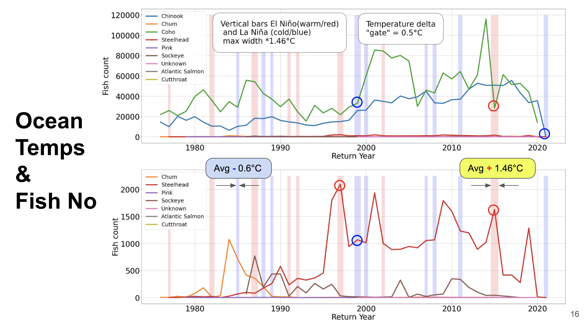
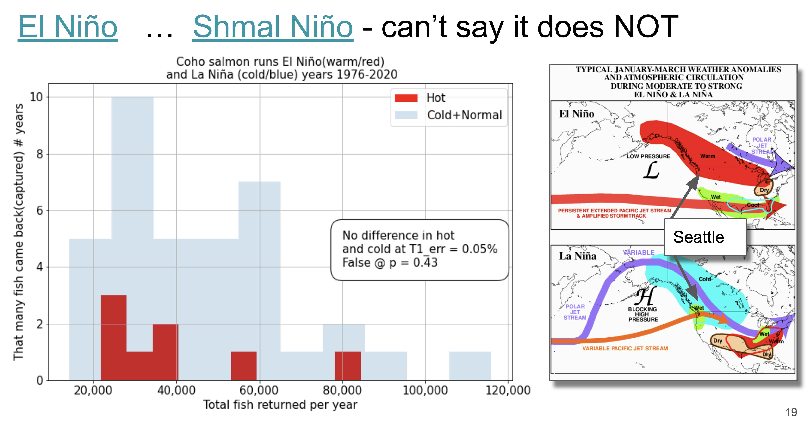

# WDFW-Coded Wire Tag Fish Recoveries

[data: 3.25M rows, 43 columns](https://data.wa.gov/Natural-Resources-Environment/WDFW-Coded-Wire-Tag-Fish-Recoveries/auvb-4rvk/data)

# Table of contents
`Markdown All in One, Command+Shift+P, Create table of contents`
- [WDFW-Coded Wire Tag Fish Recoveries](#wdfw-coded-wire-tag-fish-recoveries)
- [Table of contents](#table-of-contents)
- [Daily to Do](#daily-to-do)
- [Wow! That's what I call Data Science!](#wow-thats-what-i-call-data-science)
- [Links, References](#links-references)
- [Communications](#communications)
# Daily to Do
* Table of contents
* Structure README with sections
* Start Python script to process data and start visualizations
* [Access this Dataset via SODA API
](https://data.wa.gov/Natural-Resources-Environment/WDFW-Coded-Wire-Tag-Fish-Recoveries/auvb-4rvk)
* daily

# Data correlation Pacific temperature vs Fish numbers

# Hypothesis Testing
* Warm years do not affect fish return numbers
Ho = Warm years (delta T > threshould) do not affect fish returns

# Code Structure (Python)
## Reading subroutine

## Data Cleaning Subroutines

## Visualization Subroutines

## Statistical Analysis Subroutines

## Jupyter Mess

# Links, References
* [Presentation](https://docs.google.com/presentation/d/1alJ6Bj4SXtmc_QRkXHZ18kGtS4M2df1byW4_aMRXEak/edit#slide=id.gdf56791012_1_15)
* [Primary Data WDFW fish Recovery](https://data.wa.gov/Natural-Resources-Environment/WDFW-Coded-Wire-Tag-Fish-Recoveries/auvb-4rvk)
* [Secondary Data El Niño/La Niña](https://origin.cpc.ncep.noaa.gov/products/analysis_monitoring/ensostuff/ONI_v5.php)
